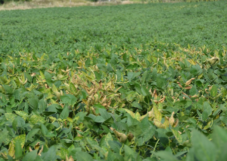

# 🌱 Soybean SDS Leaf Classifier Web App

An AI-driven Streamlit web application for detecting Sudden Death Syndrome (SDS) in soybean leaves using hyperspectral imaging at early stages — even before visual symptoms appear.

---

##  Background: What is Soybean SDS?

Sudden Death Syndrome (SDS) is one of the **most destructive diseases** of soybean in North America. Caused by the soil-borne fungus *Fusarium virguliforme*, SDS can lead to:

- Yield losses up to **50%** in severely infected fields.
- Early onset leaf chlorosis and necrosis.
- Root rot and plant death in severe cases.

🌾 **Soybean growers** struggle to detect SDS early since symptoms appear **after irreversible damage** has already occurred underground.

---

## Role of Hyperspectral Imaging and AI

Hyperspectral imaging captures **reflectance data across hundreds of narrow spectral bands**. It can detect subtle biochemical and physiological changes in plants caused by SDS:

✅ **Before** visible symptoms appear on the leaf surface  
✅ Captures stress-related spectral signatures in infected plants  
✅ Enables **early intervention** and management

This technology, when combined with deep learning (CNN models), can be trained to distinguish **healthy vs. infected leaves** with high accuracy — even at early disease stages.

---

## About This Web App

This web app allows growers and researchers to:

- **Upload calibrated hyperspectral leaf images** (.mat)
- Visualize Pseudo RGB image of leaf samples
- Generate **spectral signatures** of the central pixel
- Classify leaf into SDS infected or healthy (not-infected)
- Receive predictions using trained CNN + ML classifiers

The app uses a trained **CNN-based feature extractor** and trained Random Forest ML classical classifier from early-stage hyperspectral cubes.

---

## 🌿 Why is This Useful for Growers?

| Problem | Solution |
|--------|----------|
| SDS symptoms appear too late for chemical treatment | Early detection via hyperspectral data |
| Need for non-destructive scouting | Contactless spectral imaging at the leaf level |
| Lack of expertise to analyze hyperspectral data | Simple upload-and-diagnose web interface |
| Limited access to lab software | Free, open-access web tool for SDS detection |

---

## 🖼 Example Images

### Visual Examples

**Soybean Field Affected by SDS**  
  
*Source: MVOS Lab, South Dakota State University*

**SDS Infected Soybean Leaf**  
  
*Source: MVOS Lab, SDSU*

## 🚀 Try the Web App

🌐 [Launch the App](https://sdsumvoslabsoybeansds.streamlit.app)

---

## 🧪 Requirements for Local Setup

```bash
pip install -r requirements.txt
```

---

## 📁 Project Structure

```
├── app.py                   # Streamlit app
├── models/                  # Saved CNN and classifier models
├── images/                   # Helper scripts for visualization and inference
├── data_samples/            # Example .hdr/.iso hyperspectral image pairs
├── requirements.txt         # Theme and runtime settings
└── README.md
```

---

## 👨‍🔬 Developed By

Machine Vision and Optical Sensor (MVOS) Lab  
Department of Agricultural and Biosystems Engineering  
South Dakota State University  
[Website](https://www.sdstate.edu/agricultural-biosystems-engineering) | [MVOS Lab GitHub](https://github.com/mvoslab)

---

## 📬 Contact

For questions, collaborations, or dataset access, please reach out to:  
📧 **Dr. Pappu K. Yadav** — pappu.yadav@sdstate.edu


